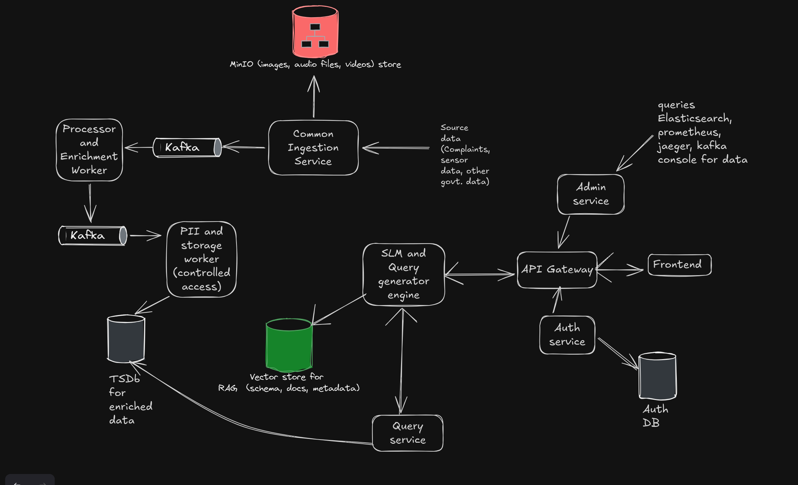

# NagarVault
An air-gapped, Privacy-First Civic Data Operating Layer for Municipal Intelligence

## Unique Features
1. Built for secure municipal servers, this stack runs locally on a k8s cluster, without any cloud dependency
2. This project will be available as a helm chart

## Architecture Diagram


## Tech stack
1. Backend services: FastAPI
2. Queue system: Kafka
3. Deployment: Helm, k8s
4. Object storage: MinIO
5. Databases: PostgreSQL
6. Vector store: QDrant
7. API Gateway: KONG
8. Logs store: ElasticSearch
9. Metrics store: Prometheus
10. Frontend: NextJS

---

## Getting started

### 1. Configure secrets

All secrets are loaded from a `.env` file at the repository root. Copy the example and fill in real values before starting the stack:

```bash
cp .env.example .env
```

Edit `.env`:

```env
# Generate with: openssl rand -hex 32
JWT_SECRET=<your-random-256-bit-hex-string>

POSTGRES_PASSWORD=<strong-database-password>

MINIO_ACCESS_KEY=<minio-access-key>
MINIO_SECRET_KEY=<minio-secret-key>
```

> **Never commit `.env` to version control.** It is already listed in `.gitignore`.

### 2. Start the stack

```bash
docker compose up --build
```

For local development with direct database/broker access (DBeaver, kafka-ui, etc.):

```bash
docker compose -f docker-compose.yml -f docker-compose.dev.yml up --build
```

### 3. Seed the first admin user

Because the `/create` endpoint is protected, the very first admin account must be created directly via the seed script. Run this once after the `auth-service` and `postgres` containers are healthy:

```bash
cd authService

# Make sure DATABASE_URL is set in your .env
python seed_admin.py --username admin --password <your-strong-password> --user-id admin-001
```

> Run this only once. If the username already exists the script exits without making changes.

After seeding, log in through the frontend at `http://localhost:4000/login` (or whichever port your auth service is on) to receive a session token. You can then create additional users through the admin-authenticated `POST /create` endpoint.

### 4. Verify services are running

```bash
# Auth service
curl http://localhost:4000/

# Admin service
curl http://localhost:4001/

# Ingestion backend
curl http://localhost:3000/health

# SLM service
curl http://localhost:4004/health
```

---

## Services and ports

| Service | Port | Notes |
|---|---|---|
| Auth service | 4000 | Login, logout, profile, user creation |
| Admin service | 4001 | Cluster health, audit logs, DLQ, vector re-sync |
| Ingestion backend | 3000 | Presigned uploads, event ingestion |
| Query service | 4003 | SQL query execution with RBAC |
| SLM service | 4004 | Natural language → SQL via local LLM |
| Schema indexer | 4005 | Embeds schema docs into Qdrant |
| Frontend | 5173 | Next.js UI |

Internal infrastructure (Postgres, Kafka, Qdrant, Ollama, Redis) is only accessible within the Docker network in production. Use `docker-compose.dev.yml` to expose their ports locally.

---

## Security notes

- All service-to-service JWT tokens use `iss=nagar-auth` / `aud=nagar-services` and expire after 60 minutes.
- Session cookies are `httponly`, `secure`, and `samesite=lax`.
- The `/login` endpoint is rate-limited to 5 requests per minute per IP.
- Internal ports (Postgres 5432, Kafka 29092, Qdrant 6333/6334, Ollama 11434) are not bound to the host in production compose.
